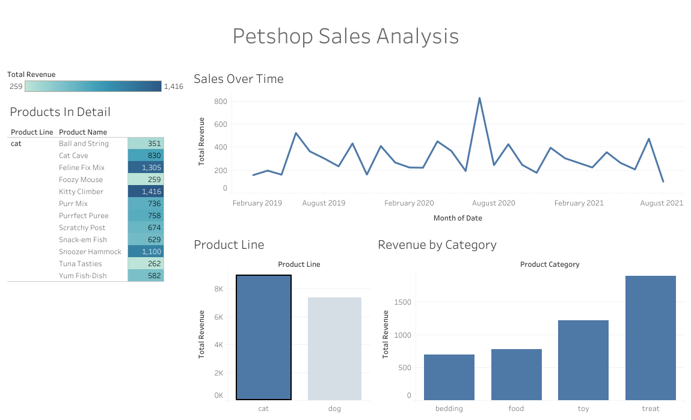
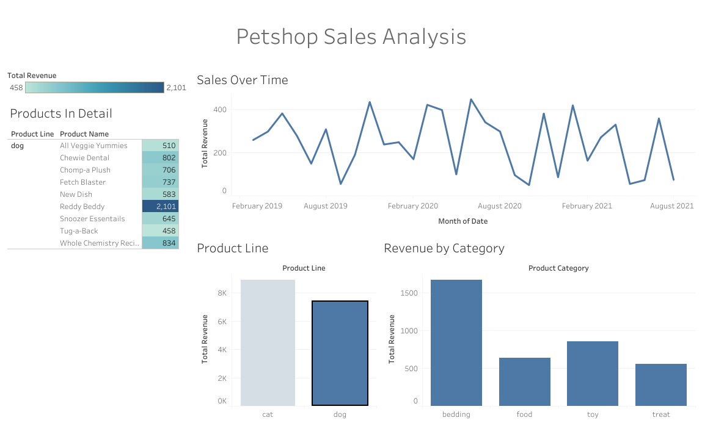

# Petshop Sales Analysis (Meta Data Analyst Mini-Project)

## Project Overview
This project demonstrates end-to-end data analysis skills developed through the **Meta Data Analyst Certificate**. The goal was to clean raw petshop sales data, perform advanced aggregations using Google Sheets' SQL-based `QUERY` function, and build an interactive dashboard in Tableau to uncover consumer behavior insights.

## Tech Stack
* **Data Cleaning:** Google Sheets (XLOOKUP, Data Validation, Trim)
* **Data Aggregation:** Google Sheets QUERY (SQL Syntax)
* **Visualization:** Tableau Public

## Key Insights
By segmenting the data by `Product_Line`, I identified distinct purchasing behaviors:
* **Dog Owners:** Primary revenue drivers for high-ticket durable goods, specifically **Bedding** (Top product: "Reddy Beddy" at $2,101).
* **Cat Owners:** Higher frequency purchasers of consumables, with **Treats** being the dominant category.

## Technical Showcase
### 1. SQL Aggregation (Google Sheets)
To calculate revenue by product while excluding invalid entries, I utilized the following query logic:
`=QUERY(data!A:I, "SELECT D, SUM(F) * SUM(H) GROUP BY D ORDER BY SUM(F) * SUM(H) DESC", 1)`

### 2. Interactive Dashboard
The final Tableau dashboard features interactive filters allowing users to toggle between Pet Types to see real-time shifts in category performance.

*Figure 1: High-level overview of petshop performance.*

*Figure 2: Using interactive filters to compare segment behavior.*

---
[Link to Live Tableau Dashboard](https://public.tableau.com/views/PetshopSalesAnalysis/Dashboard1?:language=en-US&:sid=&:redirect=auth&:display_count=n&:origin=viz_share_link)
